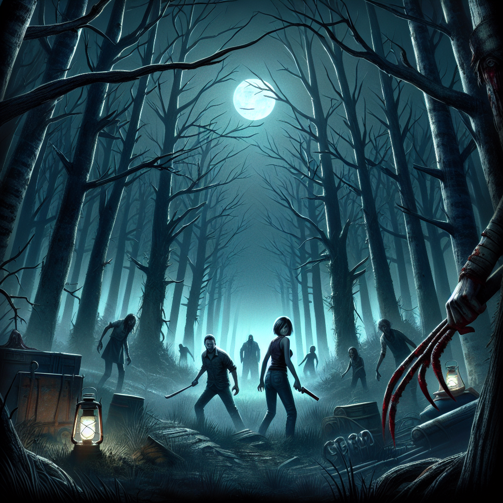
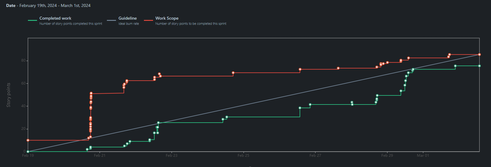

# Project Hillbilly
> A Survival Horror game.
> <!--Live demo [_here_](https://www.example.com). <!-- If you have the project hosted somewhere, include the link here. -->

## Table of Contents
* [Description](#description)
* [Technologies Used](#technologies-used)
* [General Info](#general-info)
* [Features](#features)
<!-- * [License](#license) -->

## Description
- From creators:
	- Jordan Flores
	- Gage Buckley
	- Jacob Doney
	- Diego Lechuga
	- Luis Herrera
- We are bringing you the next best Indie Survival Horror Game, for the games who enjoy a good scare!
- We hope to inspire the next generation of game developers, by showing that a good game can be made even if you don�t have the experience.
<!-- You don't have to answer all the questions - just the ones relevant to your project. -->

## Technologies Used
- Godot - version 4.2.1
- Blender

## General Info
- Cover Art  
-

## Burnup Charts
### Sprint 1  
  
### Sprint 2  
  

## Features

## Sprint 1

#### Contributions 

**Gage**: "Designed and created weapons and a vehicle"

- `Jira Task: Gage - Create Car Asset`  
	- [FER-48](https://cs3398s24ferengi.atlassian.net/browse/FER-48), 
	[Bitbucket commit](https://bitbucket.org/cs3398s24ferengi/horror-game/commits/branch/FER-48-Create-Car-Asset)
- `Jira Task: Gage - Create Pistol Weapon Asset`  
	- [FER-62](https://cs3398s24ferengi.atlassian.net/browse/FER-62), 
	[Bitbucket commit](https://bitbucket.org/cs3398s24ferengi/horror-game/commits/branch/FER-62-create-pistol-weapon-asset)
- `Jira Task: Gage - Create Shotgun Weapon Asset`  
	- [FER-64](https://cs3398s24ferengi.atlassian.net/browse/FER-64), 
	[Bitbucket commit](https://bitbucket.org/cs3398s24ferengi/horror-game/commits/branch/FER-64-create-shotgun-weapon-asset)
- `Jira Task: Gage - Create Pipe Weapon Asset`  
	- [FER-63](https://cs3398s24ferengi.atlassian.net/browse/FER-63), 
	[Bitbucket commit](https://bitbucket.org/cs3398s24ferengi/horror-game/commits/branch/FER-63-create-pipe-weapon-asset)
- `Jira Task: Gage - Create Knife Weapon Asset`  
	- [FER-73](https://cs3398s24ferengi.atlassian.net/browse/FER-73), 
	[Bitbucket commit](https://bitbucket.org/cs3398s24ferengi/horror-game/commits/branch/FER-73-create-knife-weapon-asset)

**Jacob**: "provided users with an interactive environment and scenery"

- `Jira Task: Jacob - Integrate Assets into Godot`  
	- [FER-49](https://cs3398s24ferengi.atlassian.net/browse/FER-49?atlOrigin=eyJpIjoiYWY1YmRhNGZiMjMxNGYwYWEwZTlhMzYyMmVmN2E5YWMiLCJwIjoiaiJ9), 
	[Bitbucket](https://bitbucket.org/cs3398s24ferengi/horror-game/commits/branch/FER-61-%26-FER-49-Create-Floorox)  
- `Jira Task: Jacob - Create Tree and Shrub Assets`  
	- [FER-57](https://cs3398s24ferengi.atlassian.net/browse/FER-57?atlOrigin=eyJpIjoiM2U3NjQyZmZlMzcwNDdiNmI4NzgyYTE1YWFlMGIyNjYiLCJwIjoiaiJ9), 
	[Bitbucket](https://bitbucket.org/cs3398s24ferengi/horror-game/commits/branch/JD1568-Level1-Buiild)  
- `Jira Task: Jacob - Create level one lighting design`   
	- [FER-58](https://cs3398s24ferengi.atlassian.net/browse/FER-58?atlOrigin=eyJpIjoiYWQxMDkyN2FmMjExNDllZTkyM2MzZDM2YWQzZDAwNDUiLCJwIjoiaiJ9), 
	[Bitbucket](https://bitbucket.org/cs3398s24ferengi/horror-game/commits/branch/feature%2FFER-58-lighting-design)   
- `Jira Task: Jacob - Create Scene Border`   
	- [FER-59](https://cs3398s24ferengi.atlassian.net/browse/FER-59?atlOrigin=eyJpIjoiNjIwMzY0ZmU4YzljNDZmMzk2YzEyMjExZGMzZDc4YzAiLCJwIjoiaiJ9), 
	[Bitbucket](https://bitbucket.org/cs3398s24ferengi/horror-game/commits/branch/FER-59-Border-Art)  
- `Jira Task: Jacob - Create Collision for scene objects`  
	- [FER-60](https://cs3398s24ferengi.atlassian.net/browse/FER-60?atlOrigin=eyJpIjoiODNiOTYyMThiNWQzNDI0MGI0MzJmNjQ0NjY1ZmE2MmEiLCJwIjoiaiJ9), 
	[Bitbucket](https://bitbucket.org/cs3398s24ferengi/horror-game/commits/branch/FER-60-Collision-Detection)   
- `Jira Task: Jacob - Create Floor Texture`   
	- [FER-61](https://cs3398s24ferengi.atlassian.net/browse/FER-61?atlOrigin=eyJpIjoiYzYzMDNlOTA0NTg2NDA1YmFjMjBkZTk0YmI4NGNjNzMiLCJwIjoiaiJ9), 
	[Bitbucket](https://bitbucket.org/cs3398s24ferengi/horror-game/commits/branch/FER-61-%26-FER-49-Create-Floor)   
- `Jira Task: Jacob - Create Scene Objects and Elements`   
	- [FER-69](https://cs3398s24ferengi.atlassian.net/browse/FER-69?atlOrigin=eyJpIjoiN2VjMzcyZjE2ODM0NGNmM2FhMDE2MWUxNDdmZThkZmUiLCJwIjoiaiJ9), 
	[Bitbucket](https://bitbucket.org/cs3398s24ferengi/horror-game/commits/branch/feature/FER-69-Extra-Scene-Elements)   

**Jordan**: "provided users with responsive player control and weapons"

- `Jira Task: Jordan - Design Player Control`  
	- [FER-27](https://cs3398s24ferengi.atlassian.net/browse/FER-27), 
	[Bitbucket commit](https://bitbucket.org/cs3398s24ferengi/%7B66959c0a-8754-4321-a203-1172c8ca1a8b%7D/commits/9026aa9898c8012a8c4c9c1c967a16f17c00071c)
	[Bitbucket commit](https://bitbucket.org/cs3398s24ferengi/%7B66959c0a-8754-4321-a203-1172c8ca1a8b%7D/commits/665bd1d7ceff287688398b56c3824320b11523d5)    
- `Jira Task: Jordan - Implement Player Movements`  
	- [FER-28](https://cs3398s24ferengi.atlassian.net/browse/FER-28), 
	[Bitbucket](https://bitbucket.org/cs3398s24ferengi/horror-game/commits/branch/feature%2FFER-28-implement-player-movement)  
- `Jira Task: Jordan - Implement Camera Controls`   
	- [FER-29](https://cs3398s24ferengi.atlassian.net/browse/FER-29), 
	[Bitbucket commit](https://bitbucket.org/cs3398s24ferengi/%7B66959c0a-8754-4321-a203-1172c8ca1a8b%7D/commits/4456c3d9c64383fe0f455398eb424849d50072dd)
	[Bitbucket commit](https://bitbucket.org/cs3398s24ferengi/%7B66959c0a-8754-4321-a203-1172c8ca1a8b%7D/commits/91bc5fc0dddd76e0f17a120fe0846c6a9bdb6943)     
- `Jira Task: Jordan - Control Tasks`   
	- [FER-14](https://cs3398s24ferengi.atlassian.net/browse/FER-14), 
	[Bitbucket](https://bitbucket.org/cs3398s24ferengi/horror-game/commits/branch/feature%2FFER-14-control-tasks)  
- `Jira Task: Jordan - Audio Tasks`  
	- [FER-15](https://cs3398s24ferengi.atlassian.net/browse/FER-15), 
	[Bitbucket](https://bitbucket.org/cs3398s24ferengi/horror-game/commits/branch/feature%2FFER-15-audio-task)   
- `Jira Task: Jordan - Implement Weapon Classes`   
	- [FER-38](https://cs3398s24ferengi.atlassian.net/browse/FER-38), 
	[Bitbucket](https://bitbucket.org/cs3398s24ferengi/horror-game/commits/branch/feature%2FFER-38-implement-weapon-classes)   
- `Jira Task: Jordan - Integrate Weapons into Gameplay`   
	- [FER-40](https://cs3398s24ferengi.atlassian.net/browse/FER-40), 
	[Bitbucket](https://bitbucket.org/cs3398s24ferengi/horror-game/commits/branch/feature%2FFER-40-integrate-weapons-into-gameplay)  
- `Jira Task: Jordan - Integrate new weapons to weapons system`   
	- [FER-72](https://cs3398s24ferengi.atlassian.net/browse/FER-72), 
	[Bitbucket](https://bitbucket.org/cs3398s24ferengi/horror-game/commits/branch/feature%2FFER-72-integrate-new-weapons)  
- `Jira Task: Jordan - Add additional weapon animations`   
	- [FER-74](https://cs3398s24ferengi.atlassian.net/browse/FER-74), 
	[Bitbucket](https://bitbucket.org/cs3398s24ferengi/horror-game/commits/branch/feature%2FFER-74-add-additional-weapon-animations) 
- `Jira Task: Jordan - Design Scene and Composition`   
	- [FER-50](https://cs3398s24ferengi.atlassian.net/browse/FER-50), 
	[Bitbucket](https://bitbucket.org/cs3398s24ferengi/horror-game/commits/branch/feature%2FFER-50-design-scene-and-composition)   
- `Jira Task: Jordan - Audio Task`   
	- [FER-15](https://cs3398s24ferengi.atlassian.net/browse/FER-15), 
	[Bitbucket](https://bitbucket.org/cs3398s24ferengi/horror-game/commits/branch/feature%2FFER-15-audio-task)   

**Luis**: "Designed and created the User Interface including main and in-game menu"

- `Jira Task: Luis - Menu Task`  
	- [FER-26](https://cs3398s24ferengi.atlassian.net/browse/FER-26), 
	[Bitbucket commit](https://bitbucket.org/cs3398s24ferengi/horror-game/commits/branch/feature%2FFER-26-menu-task)
- `Jira Task: Luis - Menu Scripts`  
	- [FER-47](https://cs3398s24ferengi.atlassian.net/browse/FER-47), 
	[Bitbucket commit](https://bitbucket.org/cs3398s24ferengi/horror-game/commits/branch/FER-47-menu-scrips)
- `Jira Task: Luis - Expand Settings Menu`  
	- [FER-53](https://cs3398s24ferengi.atlassian.net/browse/FER-53), 
	[Bitbucket commit](https://bitbucket.org/cs3398s24ferengi/horror-game/commits/branch/FER-53-expand-settings-menu-1)

**Diego**: "Designed and created User Interface on in-game Tutorials and mapped out tutorial layout as the game progresses"

- `Jira Task: Diego - Design Tutorial Flow`  
	- [FER-52](https://cs3398s24ferengi.atlassian.net/browse/FER-52), 
	[Bitbucket commit](https://bitbucket.org/cs3398s24ferengi/horror-game/commits/branch/FER-52-design-tutorial-flow)
- `Jira Task: Diego - Create Tutorial Menu with buttons`  
	- [FER-68](https://cs3398s24ferengi.atlassian.net/browse/FER-68), 
	[Bitbucket commit](https://bitbucket.org/cs3398s24ferengi/horror-game/commits/branch/FER-68-create-tutorial-menu-with-buttons)
- `Jira Task: Diego - Create Main Controls Menu`  
	- [FER-71](https://cs3398s24ferengi.atlassian.net/browse/FER-71), 
	[Bitbucket commit](https://bitbucket.org/cs3398s24ferengi/horror-game/commits/branch/FER-71-create-main-controls-menu)
- `Jira Task: Diego - Research Common Video Game Tutorials`  
	- [FER-70](https://cs3398s24ferengi.atlassian.net/browse/FER-70), 
	[Bitbucket commit](https://bitbucket.org/cs3398s24ferengi/horror-game/commits/branch/FER-70-research-common-video-game-tutori)

### Next Steps for Sprint 2

**Gage**  
-	Design and create player character  
-	Design and create environment elements  
-	Design and create enemy non-player character weapons  
-	Design puzzle for level one  

**Jacob:**	
-	Design level one objectives  
- 	Design and create enemy non-player characters  
- 	Create enemy AI to interact with player  
- 	Create interactive elements in level  

**Jordan:**  
-	Implement enemy AI to target player  
- 	Design and implement new weapons  
- 	Refine player controls  
- 	Refine gameplay loop in level one

**Luis:**	
-	Consolidate the menus to optimize code and size  
-	Fix known bugs in the menu  
-	Complete the pause game menu  
-	Create audio buses and connect them to audio files  

**Diego:**	
-	Add menu music to tutorial menus.  
-	Fix known bugs in the menu.  
-	Make sure buttons from other menus link to tutorial menus.  
-	Edit buttons and menu so that they fit the theme of the game  
-	Edit menu backgrounds so that they have the same theme as the main  

## Sprint 2

#### Contributions 

**Luis**: "Enhanced the User Interface and Expanded the Audio options"

- `Jira Task: Luis - Combine Main and Settings Menu` 
	- [FER-33](https://cs3398s24ferengi.atlassian.net/browse/FER-33),
	[Bitbucket commit](https://bitbucket.org/cs3398s24ferengi/horror-game/commits/branch/FER-33-combine-main-and-settings-menu)

- `Jira Task: Luis - Fix the Audio sliders in the main and in-game menu`
	- [FER-83](https://cs3398s24ferengi.atlassian.net/browse/FER-83),
	[Bitbucket commit](https://bitbucket.org/cs3398s24ferengi/horror-game/commits/branch/FER-83-fix-the-audio-sliders-in-the-main)
	
- `Jira Task: Luis - Create Audio Busses`
	- [FER-93](https://cs3398s24ferengi.atlassian.net/browse/FER-93),
	[Bitbucket commit](https://bitbucket.org/cs3398s24ferengi/horror-game/commits/branch/FER-93-create-audio-busses)
	
- `Jira Task: Luis - Add audio for enemies`
	- [FER-92](https://cs3398s24ferengi.atlassian.net/browse/FER-92),
	[Bitbucket commit](https://bitbucket.org/cs3398s24ferengi/horror-game/commits/branch/FER-92-add-audio-to-enemies)
	
- `Jira Task: Luis - Fix and expand In-game menu`
	- [FER-34](https://cs3398s24ferengi.atlassian.net/browse/FER-34),
	[Bitbucket commit](https://bitbucket.org/cs3398s24ferengi/horror-game/commits/branch/FER-34-fix-and-expand-in-game-menu)
	
- `Jira Task: Luis - Combine Tutorial scene into main and In-game menu`
	- [FER-94](https://cs3398s24ferengi.atlassian.net/browse/FER-94),
	[Bitbucket commit](https://bitbucket.org/cs3398s24ferengi/horror-game/commits/branch/FER-94-combine-tutorial-scene-into-main-)
	
- `Jira Task: Luis - Testing audio levels`
	- [FER-36](https://cs3398s24ferengi.atlassian.net/browse/FER-36),
	[Bitbucket commit](https://bitbucket.org/cs3398s24ferengi/horror-game/commits/branch/FER-36-testing-audio-levels)
	
- `Jira Task: Luis - Fix checkboxes on video settings`
	- [FER-95](https://cs3398s24ferengi.atlassian.net/browse/FER-95),
	[Bitbucket commit](https://bitbucket.org/cs3398s24ferengi/horror-game/commits/branch/FER-95-fix-checkboxes-on-video-settings)

**Jacob**: "Provided users animated enemy charaters"

- `Jira Task: Jacob - Create weak enemy run animation` 
	- [FER-110](https://cs3398s24ferengi.atlassian.net/browse/FER-110), 
	[Bitbucket](https://bitbucket.org/cs3398s24ferengi/horror-game/commits/branch/FER-110-Create-Enemy-Animation-Run)

- `Jira Task: Jacob - Create weak enemy walk animation`
	- [FER-109](https://cs3398s24ferengi.atlassian.net/browse/FER-109), 
	[Bitbucket](https://bitbucket.org/cs3398s24ferengi/horror-game/commits/branch/FER-109-Create-Enemy-Walk-Animation)  

- `Jira Task: Jacob - Create weak enemy attack animation`
	- [FER-108](https://cs3398s24ferengi.atlassian.net/browse/FER-108), 
	[Bitbucket](https://bitbucket.org/cs3398s24ferengi/horror-game/commits/branch/FER-108-implement-weak-enemy-attack)   

- `Jira Task: Jacob - Create boss walk and attack animations`
	- [FER-104](https://cs3398s24ferengi.atlassian.net/browse/FER-104), 
	[Bitbucket](https://bitbucket.org/cs3398s24ferengi/horror-game/commits/branch/FER-104-Create-boss-animations)  

- `Jira Task: Jacob - Design weak enemy assests`
	- [FER-85](https://cs3398s24ferengi.atlassian.net/browse/FER-85), 
	[Bitbucket](https://bitbucket.org/cs3398s24ferengi/horror-game/commits/branch/FER-85-Design-first-enemy-asset)   

- `Jira Task: Jacob - Implement weak enemy attack animation settings`
	- [FER-108](https://cs3398s24ferengi.atlassian.net/browse/FER-108), 
	[Bitbucket](https://bitbucket.org/cs3398s24ferengi/horror-game/commits/branch/FER-108-implement-weak-enemy-attack)   

**Gage**: "Designed and created assets for enemies and created a puzzle"

- `Jira Task: Gage - Create Flashlight Asset`  
	- [FER-102](https://cs3398s24ferengi.atlassian.net/browse/FER-102), 
	[Bitbucket commit](https://bitbucket.org/cs3398s24ferengi/horror-game/commits/branch/FER-102-create-flashlight-asset)
- `Jira Task: Gage - Create Key Assets`  
	- [FER-103](https://cs3398s24ferengi.atlassian.net/browse/FER-103), 
	[Bitbucket commit](https://bitbucket.org/cs3398s24ferengi/horror-game/commits/branch/FER-103-create-key-assets)
- `Jira Task: Gage - Create Ammo Assets`  
	- [FER-106](https://cs3398s24ferengi.atlassian.net/browse/FER-106), 
	[Bitbucket commit](https://bitbucket.org/cs3398s24ferengi/horror-game/commits/branch/FER-106-create-ammo-assets)
- `Jira Task: Gage - Create Shovel Asset`  
	- [FER-112](https://cs3398s24ferengi.atlassian.net/browse/FER-112), 
	[Bitbucket commit](https://bitbucket.org/cs3398s24ferengi/horror-game/commits/branch/FER-112-create-shovel-asset)
- `Jira Task: Gage - Create Hatchet Asset`  
	- [FER-111](https://cs3398s24ferengi.atlassian.net/browse/FER-111), 
	[Bitbucket commit](https://bitbucket.org/cs3398s24ferengi/horror-game/commits/branch/FER-111-create-hatchet-asset)
- `Jira Task: Gage - Create Rake Asset`  
	- [FER-113](https://cs3398s24ferengi.atlassian.net/browse/FER-113), 
	[Bitbucket commit](https://bitbucket.org/cs3398s24ferengi/horror-game/commits/branch/FER-113-create-rake-asset)
- `Jira Task: Gage - Create Padlock Assets`  
	- [FER-105](https://cs3398s24ferengi.atlassian.net/browse/FER-105), 
	[Bitbucket commit](https://bitbucket.org/cs3398s24ferengi/horror-game/commits/branch/FER-105-create-padlock-assets)
- `Jira Task: Gage - Fix colors not appearing on new assets`  
	- [FER-123](https://cs3398s24ferengi.atlassian.net/browse/FER-123), 
	[Bitbucket commit](https://bitbucket.org/cs3398s24ferengi/horror-game/commits/branch/FER-123-fix-colors-not-appearing-on-new-)
- `Jira Task: Gage - Create Boss Asset`  
	- [FER-96](https://cs3398s24ferengi.atlassian.net/browse/FER-96), 
	[Bitbucket commit](https://bitbucket.org/cs3398s24ferengi/horror-game/commits/branch/FER-96-create-boss-asset)
- `Jira Task: Gage - Design puzzle for level 1`  
	- [FER-91](https://cs3398s24ferengi.atlassian.net/browse/FER-91), 
	[Bitbucket commit](https://bitbucket.org/cs3398s24ferengi/horror-game/commits/branch/FER-91-design-puzzle-for-level-1)

**Jordan**: "Provided users with gameplay systems like inventory, enemy AI and spawning, and wave gameplay"

- `Jira Task: Jordan - Implement weapon inventory system`  
	- [FER-77](https://cs3398s24ferengi.atlassian.net/browse/FER-77), 
	[Bitbucket commit](https://bitbucket.org/cs3398s24ferengi/horror-game/commits/branch/FER-77-implement-weapon-inventory-system)
- `Jira Task: Jordan - Implement ammo inventory`  
	- [FER-78](https://cs3398s24ferengi.atlassian.net/browse/FER-78), 
	[Bitbucket commit](https://bitbucket.org/cs3398s24ferengi/horror-game/commits/branch/FER-78-implement-ammo-inventory)
- `Jira Task: Jordan - Implement misc. inventory (keys, flashlight, etc.)`
	- [FER-79](https://cs3398s24ferengi.atlassian.net/browse/FER-79), 
	[Bitbucket commit](https://bitbucket.org/cs3398s24ferengi/horror-game/commits/branch/FER-79-implement-misc.-inventory)
- `Jira Task: Jordan - Implement world for "endless mode"`
	- [FER-88](https://cs3398s24ferengi.atlassian.net/browse/FER-88), 
	[Bitbucket commit](https://bitbucket.org/cs3398s24ferengi/horror-game/commits/branch/FER-88-implement-world-for-endless-mode)
- `Jira Task: Jordan - Implement weapon upgrade system for "endless mode"`
	- [FER-89](https://cs3398s24ferengi.atlassian.net/browse/FER-89), 
	[Bitbucket commit](https://bitbucket.org/cs3398s24ferengi/horror-game/commits/branch/FER-89-implement-weapon-upgrade-system)
- `Jira Task: Jordan - Implement enemy wave system for "endless mode"`
	- [FER-90](https://cs3398s24ferengi.atlassian.net/browse/FER-90), 
	[Bitbucket commit](https://bitbucket.org/cs3398s24ferengi/horror-game/commits/branch/FER-90-implement-enemy-wave-system)
- `Jira Task: Jordan - Implement boss class and system`
	- [FER-97](https://cs3398s24ferengi.atlassian.net/browse/FER-97), 
	[Bitbucket commit](https://bitbucket.org/cs3398s24ferengi/horror-game/commits/branch/FER-97-implement-boss-class-and-system)
- `Jira Task: Jordan - Implement base enemy movement`
	- [FER-107](https://cs3398s24ferengi.atlassian.net/browse/FER-107), 
	[Bitbucket commit](https://bitbucket.org/cs3398s24ferengi/horror-game/commits/branch/feature/FER-107-implement-base-enemy-movement)
- `Jira Task: Jordan - Implement enemy combat movement`
	- [FER-118](https://cs3398s24ferengi.atlassian.net/browse/FER-118), 
	[Bitbucket commit](https://bitbucket.org/cs3398s24ferengi/horror-game/commits/branch/feature/FER-118-implement-enemy-combat-movement)
- `Jira Task: Jordan - Refactor weapon code`
	- [FER-119](https://cs3398s24ferengi.atlassian.net/browse/FER-119), 
	[Bitbucket commit](https://bitbucket.org/cs3398s24ferengi/horror-game/commits/branch/FER-119-refactor-weapon-code)
- `Jira Task: Jordan - Implement item pickup system`
	- [FER-120](https://cs3398s24ferengi.atlassian.net/browse/FER-120), 
	[Bitbucket commit](https://bitbucket.org/cs3398s24ferengi/horror-game/commits/branch/FER-120-implement-item-pickup-system)
- `Jira Task: Jordan - Implement wave system UI`
	- [FER-121](https://cs3398s24ferengi.atlassian.net/browse/FER-121), 
	[Bitbucket commit](https://bitbucket.org/cs3398s24ferengi/horror-game/commits/branch/FER-121-implement-wave-system-ui)
- `Jira Task: Jordan - Add video settings`
	- [FER-122](https://cs3398s24ferengi.atlassian.net/browse/FER-122), 
	[Bitbucket commit](https://bitbucket.org/cs3398s24ferengi/horror-game/commits/branch/FER-122-add-video-settings)
- `Jira Task: Jordan - Create enemy attack function`
	- [FER-124](https://cs3398s24ferengi.atlassian.net/browse/FER-124), 
	[Bitbucket commit](https://bitbucket.org/cs3398s24ferengi/horror-game/commits/branch/FER-124-create-enemy-attack-function)

**Diego**: "Enhanced User Interfaces, Tutorial Menus, and created adaptive Health Bar"

- `Jira Task: Diego - Fix Tutorial Menu graphics to match game theme`  
	- [FER-114](https://cs3398s24ferengi.atlassian.net/browse/FER-114), 
	[Bitbucket commit](https://bitbucket.org/cs3398s24ferengi/horror-game/commits/branch/FER-114-fix-tutorial-menu-graphics-to-match-game-theme)
- `Jira Task: Diego - fix tutorial image blurriness`  
	- [FER-115](https://cs3398s24ferengi.atlassian.net/browse/FER-115), 
	[Bitbucket commit](https://bitbucket.org/cs3398s24ferengi/horror-game/commits/branch/FER-115-fix-tutorial-image-blurriness)
- `Jira Task: Diego - create health bar ui`  
	- [FER-116](https://cs3398s24ferengi.atlassian.net/browse/FER-116), 
	[Bitbucket commit](https://bitbucket.org/cs3398s24ferengi/horror-game/commits/branch/FER-116-create-health-bar-ui)
- `Jira Task: Diego - implement dynamic health bar functionality`  
	- [FER-117](https://cs3398s24ferengi.atlassian.net/browse/FER-117), 
	[Bitbucket commit](https://bitbucket.org/cs3398s24ferengi/horror-game/commits/branch/FER-117-implement-dynamic-health-bar-fun)

### Next Steps for Sprint 3

**Luis:**	
-	Create a Save/Load functionality.  
-	Continue to  improve the stability of the UI.  
-	Continue to expand on the audio options.  
-	Create a working introduction animation.  

**Jacob:**	
-	Create a point tracker.  
-	Create a leaderboard.  
-	Continue to improve on animations.  
-	Change enemy behavior based on proximity to player.  

**Gage:**	
-	Create and animate another enemy.  
-	Design and create assets for level 1.  
-	Implement the puzzle into level 1.  
-	Improve some assets I made for sprint 1.  

**Jordan:**	
-	Add recoil to weapons.  
-   Add hit FX for bullets.  
-   Add bullet tracers.  
-   Adjust enemy spawning from all-at-once.  
-   Add more weapon upgrades.  

**Diego:**	
-	Make sure Health Bar updates as the player's health changes.  
-   Add Health Bar to enemies.  
-   Further improve Menu UI.  
-   Create more adaptive animations to help the player such as point tracking.  

## Sprint 3

#### Contributions 

**Luis**: "Create an engaging and visualty pleasing animations and cinematics"

- `Jira Task: Luis - Implement a moving car in main menu` 
	- [FER-76](https://cs3398s24ferengi.atlassian.net/browse/FER-76),
	[Bitbucket commit](https://bitbucket.org/cs3398s24ferengi/horror-game/commits/branch/FER-76-implement-a-moving-car-in-main-me)
- `Jira Task: Luis - Created a moving car animation` 
	- [FER-55](https://cs3398s24ferengi.atlassian.net/browse/FER-55),
	[Bitbucket commit](https://bitbucket.org/cs3398s24ferengi/horror-game/commits/branch/FER-55-created-a-moving-car-animation)
- `Jira Task: Luis - Added music to end game cut scene` 
	- [FER-81](https://cs3398s24ferengi.atlassian.net/browse/FER-81),
	[Bitbucket commit](https://bitbucket.org/cs3398s24ferengi/horror-game/commits/branch/FER-81-added-music-to-end-game-cut-scene)
- `Jira Task: Luis - Create missing Audio and add to intro cinematic` 
	- [FER-84](https://cs3398s24ferengi.atlassian.net/browse/FER-84),
	[Bitbucket commit](https://bitbucket.org/cs3398s24ferengi/horror-game/commits/branch/FER-84-create-missing-audio-and-add-to-i)
- `Jira Task: Luis - Create a basic death cut scene` 
	- [FER-99](https://cs3398s24ferengi.atlassian.net/browse/FER-99),
	[Bitbucket commit](https://bitbucket.org/cs3398s24ferengi/horror-game/commits/branch/FER-99-create-a-basic-death-cut-scene)
- `Jira Task: Luis - Connected intro cutscene to Menu` 
	- [FER-54](https://cs3398s24ferengi.atlassian.net/browse/FER-54),
	[Bitbucket commit](https://bitbucket.org/cs3398s24ferengi/horror-game/commits/branch/FER-54-connected-intro-cutscene-to-menu)
- `Jira Task: Luis - Add a pop up tittle to intro cinematic` 
	- [FER-82](https://cs3398s24ferengi.atlassian.net/browse/FER-82),
	[Bitbucket commit](https://bitbucket.org/cs3398s24ferengi/horror-game/commits/branch/FER-82-add-a-pop-up-tittle-to-intro-cine)
- `Jira Task: Luis - Upgrade Main Menu cinematic` 
	- [FER-80](https://cs3398s24ferengi.atlassian.net/browse/FER-80),
	[Bitbucket commit](https://bitbucket.org/cs3398s24ferengi/horror-game/commits/branch/FER-80-upgrade-main-menu-cinematic)
- `Jira Task: Luis - Fix animations` 
	- [FER-86](https://cs3398s24ferengi.atlassian.net/browse/FER-86),
	[Bitbucket commit](https://bitbucket.org/cs3398s24ferengi/horror-game/src/FER-86-fix-animations)
	
	

**Jacob**: "Create feedback to in game player actions"

- `Jira Task: Jacob - Created animation for hit enemies
	- [FER-125](https://cs3398s24ferengi.atlassian.net/browse/FER-125),
	[Bitbucket commit](https://bitbucket.org/cs3398s24ferengi/horror-game/commits/branch/FER-125-Create-animation-for-hit-Enemies)
- `Jira Task: Jacob - Created alt textures for enemies
	- [FER-126](https://cs3398s24ferengi.atlassian.net/browse/FER-126),
	[Bitbucket commit](https://bitbucket.org/cs3398s24ferengi/horror-game/commits/branch/FER-126-Create-alt-textures-for-Enemies)
- `Jira Task: Jacob - Make enemy behavior dynamic based on players location` 
	- [FER-127](https://cs3398s24ferengi.atlassian.net/browse/FER-127),
	[Bitbucket commit](https://bitbucket.org/cs3398s24ferengi/horror-game/commits/branch/FER-127-Make-enemy-behavior-dynamic)
- `Jira Task: Jacob - Add particle animations to defeated enemy` 
	- [FER-128](https://cs3398s24ferengi.atlassian.net/browse/FER-128),
	[Bitbucket commit](https://bitbucket.org/cs3398s24ferengi/horror-game/commits/branch/FER-128-Add-particle-animations-to-defeated-enemy)
- `Jira Task: Jacob - Create interactive boxes
	- [FER-154](https://cs3398s24ferengi.atlassian.net/browse/FER-154),
	[Bitbucket commit](https://bitbucket.org/cs3398s24ferengi/horror-game/commits/branch/FER-154-Create-interactive-boxes)
- `Jira Task: Jacob - Update world map
	- [FER-155](https://cs3398s24ferengi.atlassian.net/browse/FER-155),
	[Bitbucket commit](https://bitbucket.org/cs3398s24ferengi/horror-game/commits/branch/FER-155-Update-world-map)
- `Jira Task: Jacob - Debug and fix bugs 
	- [FER-156](https://cs3398s24ferengi.atlassian.net/browse/FER-156),
	[Bitbucket commit](https://bitbucket.org/cs3398s24ferengi/horror-game/commits/branch/FER-156-Debug)

<!-- Optional -->
<!-- ## License -->
<!-- This project is open source and available under the [... License](). -->

<!-- You don't have to include all sections - just the one's relevant to your project -->
